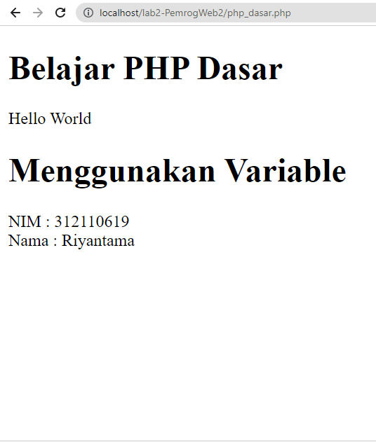
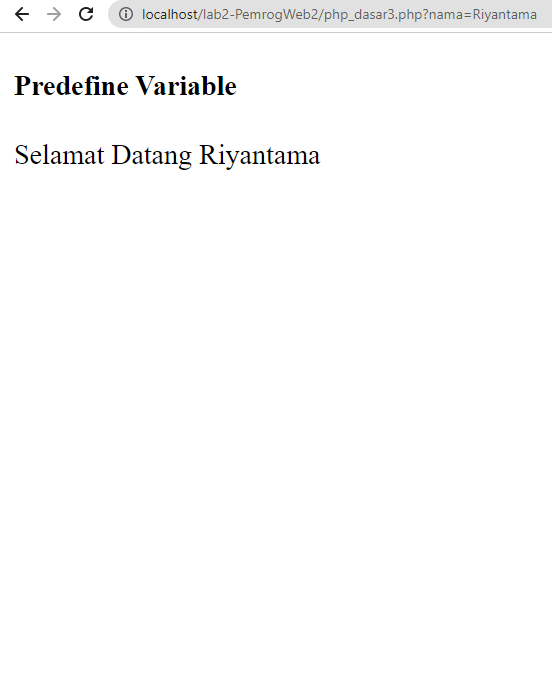
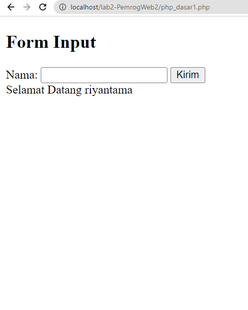
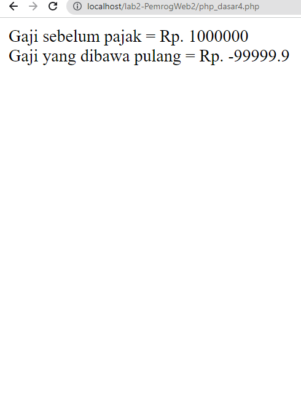
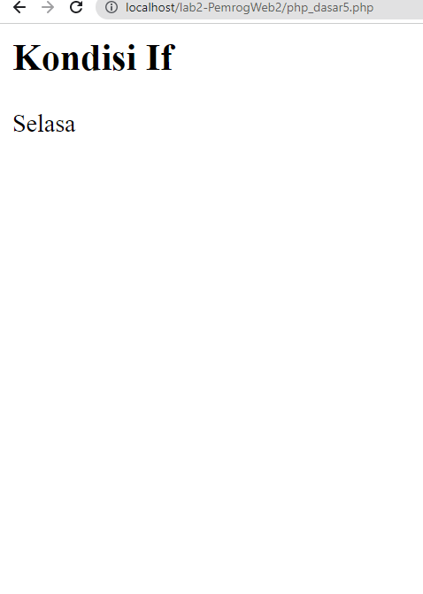
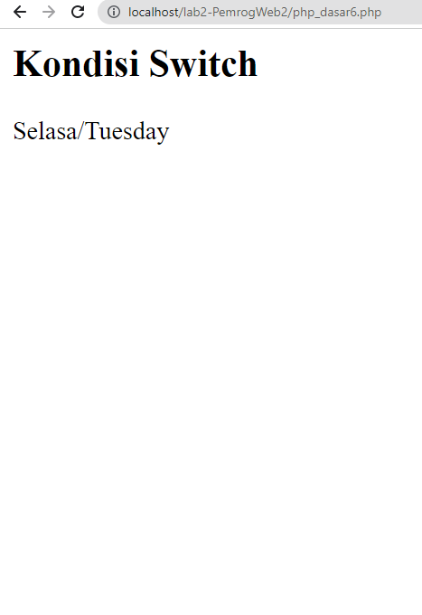
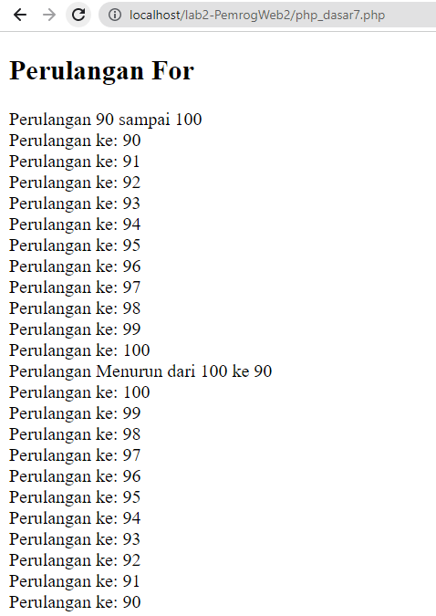
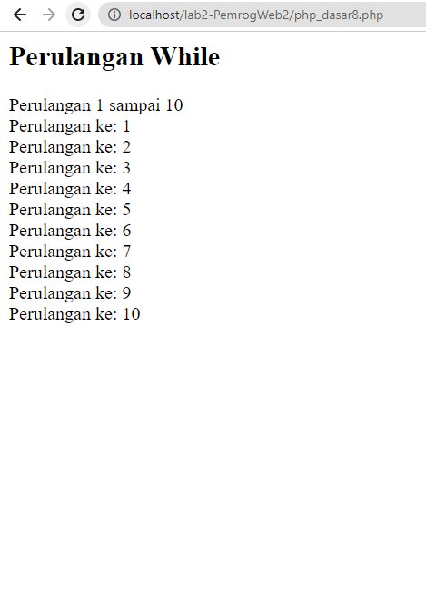
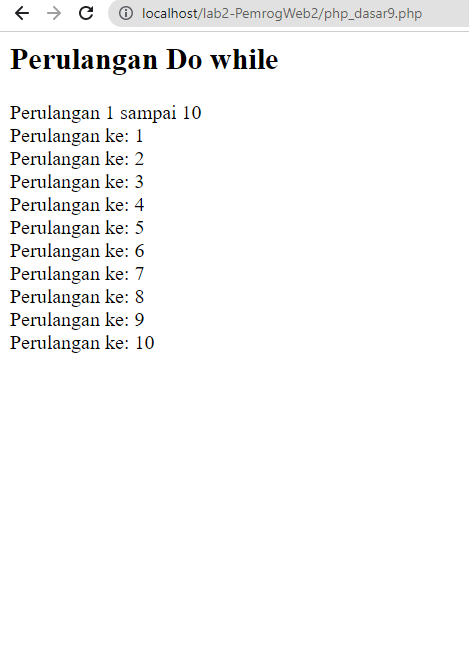

# TUGAS Lab2 PHP Dasar Pemograman Web

## Latihan ke 1

### **Code**
```
<!DOCTYPE html>
<html lang="en">

<head>
    <meta charset="UTF-8">
    <title>PHP Dasar</title>
</head>

<body>
    <h1>Belajar PHP Dasar</h1>
    <?php
    echo "Hello World";
    ?>
</body>
<h1>Menggunakan Variable</h1>
<?php
$nim = "312110619";
$nama = 'Riyantama';
echo "NIM : " . $nim . "<br>";
echo "Nama : $nama";
?>

</html>
```
### **Output**
<br><br>

### **Penjelasan**
>Code diatas adalah contoh untuk memasukkan value kedalam variabel nama dan nim, setelah itu dilanjutkan dengan menampilkan kedalam web browser

## Latihan ke 2

### **Code**
```
<!DOCTYPE html>
<html lang="en">

<head>
  <meta charset="UTF-8">
  <meta http-equiv="X-UA-Compatible" content="IE=edge">
  <meta name="viewport" content="width=device-width, initial-scale=1.0">
  <title>PHP Dasar</title>
</head>

<body>
  <!-- Variabel $_GET -->
  <h4><b>Predefine Variable</b></h4>
  <?php
  echo 'Selamat Datang ' . $_GET['nama']
  ?>
</body>

</html>
```

### **Output**


### **Penjelasan**
>Code diatas merupakan contoh untuk mendapatkan value dari query 'nama'

## Latihan ke 3

### **Code**
```
<!DOCTYPE html>
<html lang="en">

<head>
    <meta charset="UTF-8">
    <title>PHP Dasar</title>
</head>

<body>
    <h2>Form Input</h2>
    <form method="post">
        <label>Nama: </label>
        <input type="text" name="nama">
        <input type="submit" value="Kirim">
    </form>
    <?php
    echo 'Selamat Datang ' . $_POST['nama'];
    ?>
</body>

</html>
```
### **Output**


### **Penjelasan**
>Code diatas merupakan contoh untuk mengirimkan value dari form dengan method post dan kemudian diambil menggunakan query `nama`

## Latihan ke 4

### **Code**
```
<! html DOCTYPE>
<html lang="en">

<Head>
  <meta charset="UTF-8">
  <meta http-equiv="X-UA-Compatible" content="IE=edge">
  <meta name="viewport" content="width=device-width, initial-scale=1.0">
  <Basic ></title>
</Head>

<body>
  <?php
  $gaji = 1000000;
  $pajak = 0.1;
  $THP = $pajak - ($gaji *  $pajak);
  Echo "Gaji sebelum pajak = Rp.  $gaji <br>";
  Echo "Gaji yang dibawa pulang = Rp.  $THP";
  ?>
</body>

</html>
```
### **Output**



## Latihan ke 5
### **Code**
```
<! html DOCTYPE>
<html lang="en">

<Head>
  <meta charset="UTF-8">
  <meta http-equiv="X-UA-Compatible" content="IE=edge">
  <meta name="viewport" content="width=device-width, initial-scale=1.0">
  <Basic ></title>
</Head>

<body>
  <h2>Kondisi If</h2>
  <?php
  $nama_hari = date("l");
  if ($nama_hari == "Minggu") {
    Echo "Sunday";
  } elseif ($nama_hari == "Senin") {
    Echo "Monday";
  } else {
    Echo "Selasa";
  }
  ?>
</body>

```
### **Output**


### **Penjelasan**
>Code diatas merupakan contoh pengkondisian if else

## Latihan ke 6
### **Code**
```
<h2>Kondisi Switch</h2>
<?php
$nama_hari = date("l");
Switch ($nama_hari) {
  case "Minggu":
    Echo "Sunday";
    Break;
  case "Senin":
    Echo "Monday";
    Break;
  case "Selasa":
    Echo "Tuesday";
    Break;
  Default:
    Echo "Selasa";
}
Echo "/$nama_hari";
?>
```
### **Output**


### **Penjelasan**
>Code diatas merupakan contoh pengkondisian menggunakan switch case

## Latihan ke 7
### **Code**
```
  <!DOCTYPE html>
<html lang="en">

<head>
  <meta charset="UTF-8">
  <meta http-equiv="X-UA-Compatible" content="IE=edge">
  <meta name="viewport" content="width=device-width, initial-scale=1.0">
  <title>PHP Dasar</title>
</head>

<body>
  <h2>Perulangan For</h2>
  <?php
  echo "Perulangan 90 sampai 100 <br />";
  for ($i = 90; $i <= 100; $i++) {
    echo "Perulangan ke: " . $i . '<br />';
  }
  echo "Perulangan Menurun dari 100 ke 90 <br />";
  for ($i = 100; $i >= 90; $i--) {
    echo "Perulangan ke: " . $i . '<br />';
  }
  ?>
</body>

</html>
```
### **Output**


### **Penjelasan**
>Code diatas merupakan contoh perulangan menggunakan for

## Latihan ke 8
### **Code**
```
<h2>Perulangan While</h2>
<?php
echo "Perulangan 1 sampai 10 <br />";
$i = 1;
while ($i <= 10) {
  echo "Perulangan ke: " . $i . '<br />';
  $i++;
}
?>
```
### **Output**


### **Penjelasan**
>Code diatas merupakan contoh perulangan menggunakan while

## Latihan ke 9
### **Code**
```
<h2>Perulangan Do while</h2>
<?php
echo "Perulangan 1 sampai 10 <br />";
$i = 1;
do {
  echo "Perulangan ke: " . $i . '<br />';
  $i++;
} while ($i <= 10);
?>
```
### **Output**


### **Penjelasan**
>Code diatas merupakan contoh perulangan menggunakan do while

